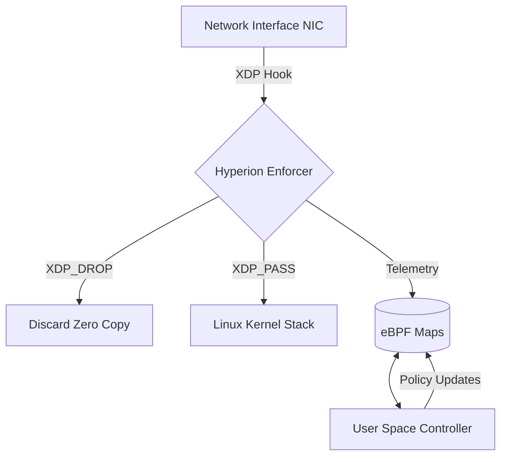

# Project Hyperion: Datapath Security Research


-blue?style=flat-square)


**Hyperion** is a high-performance network security engine designed to enforce stateful policy at the NIC driver level. Unlike traditional firewalls that operate at the socket layer (Netfilter), Hyperion uses **eBPF (Extended Berkeley Packet Filter)** and **XDP (Express Data Path)** to reject malicious traffic before the Linux Kernel allocates memory.

> **Research Context:** This project serves as the Network Satellite to the [Sentinel Runtime](https://github.com/nevinshine/sentinel-runtime) (Host Anchor), exploring the unification of process-level and packet-level defense.

---

## Research Motivation

Modern endpoint security focuses heavily on process-level control (syscalls). However, by the time a packet reaches a process, the kernel has already consumed significant resources parsing headers and managing buffers.

**The Research Question**
> *Can security policy be enforced at wire speed, retaining temporal context, before the Operating System commits resources?*

### The "Two Towers" Architecture

Hyperion complements Sentinel by securing the transport boundary.

| Dimension | Sentinel (The Host) | Hyperion (The Wire) |
| :--- | :--- | :--- |
| **Boundary** | Process Execution | Network Transport |
| **Mechanism** | `ptrace` / Kernel Modules | `eBPF` / `XDP` |
| **Visibility** | Syscalls (`execve`, `open`) | Packets (`SYN`, `payload`) |
| **Constraint** | Context-Aware Logic | Microsecond Latency |
| **Threats** | Ransomware, Droppers | DDoS, C2 Beacons |

---

## System Architecture

Hyperion operates on a split-plane design, utilizing the driver's interrupt context for maximum throughput.



### 1. Kernel Enforcer (`src/kern/`)

* **Technology:** Restricted C (eBPF).
* **Role:** Parses Ethernet/IP/TCP headers and applies verdicts.
* **Performance:** Operates in the driver's native execution path.

### 2. User Space Controller (`src/user/`)

* **Technology:** Go (using `cilium/ebpf` or `libbpf`).
* **Role:** Loads BPF programs, manages Map lifecycles (Hash/LRU), and exports telemetry to the Sentinel Runtime.

---

## Research Roadmap

We define success through distinct capability milestones.

### [Phase M0] Foundation

* **Goal:** Establish eBPF toolchain and verification pipeline.
* **Deliverable:** `XDP_PASS` skeleton compiling with Clang/LLVM.

### [Phase M1] Stateless Filtering

* **Goal:** Implement high-performance dropping based on L3/L4 headers.
* **Research Validation:** Benchmarking CPU load of `XDP_DROP` vs `iptables` under flood conditions.

### [Phase M2] Temporal State

* **Goal:** Implement stateful logic in BPF Maps.
* **Logic:** Track packet arrival timestamps to detect periodic C2 beacons.
```c
// Concept Logic
u64 delta = now - last_seen_time;
if (abs(delta - BEACON_INTERVAL) < EPSILON) {
    return XDP_DROP;
}

```


### [Phase M3] Sentinel Integration

* **Goal:** Correlate network signals with process intent.
* **Scenario:** Hyperion flags a C2 beacon; Sentinel maps it to a PID and halts execution.

### [Phase M4] Policy Learning (Auto-Profiling)

* **Goal:** Generate "Least Privilege" network profiles by observing safe traffic patterns, solving the manual policy authorship problem.

---

## Build & Run

### Prerequisites

* Linux Kernel 5.4+ (5.10+ recommended for CO-RE)
* `clang`, `llvm`, `libbpf-dev`
* `golang` (1.20+)

### Quick Start (M0)

```bash
# 1. Compile the eBPF Kernel Object
clang -O2 -g -target bpf -c src/kern/hyperion_core.c -o src/kern/hyperion_core.o

# 2. Load into Kernel (Requires Root)
sudo ip link set dev eth0 xdp obj src/kern/hyperion_core.o sec xdp

# 3. Verify Attachment
ip link show dev eth0

```

---

## License

This project is dual-licensed under the **GPLv2** (Kernel components) and **MIT** (User space components) to ensure compatibility with the Linux Kernel eBPF verifier.
