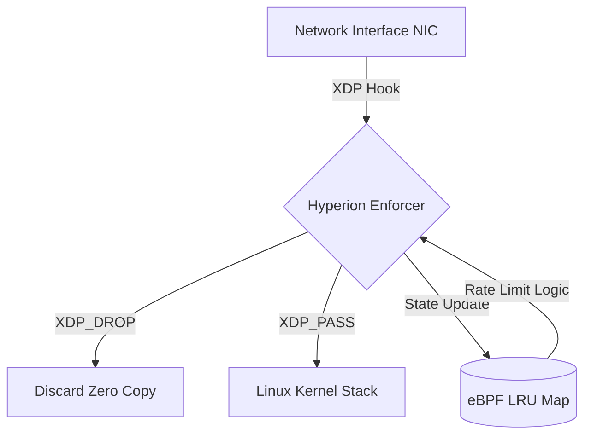

# Project Hyperion: Datapath Security Research


-blue?style=flat-square)


**Hyperion** is a high-performance network security engine designed to enforce stateful policy at the NIC driver level. Unlike traditional firewalls that operate at the socket layer (Netfilter), Hyperion uses **eBPF (Extended Berkeley Packet Filter)** and **XDP (Express Data Path)** to reject malicious traffic before the Linux Kernel allocates memory.

> **Research Context:** This project serves as the Network Satellite to the [Sentinel Runtime](https://github.com/nevinshine/sentinel-runtime) (Host Anchor). Authored by **Nevin**, it explores the unification of process-level and packet-level defense for the MSc Cybersecurity Research Portfolio.

---

## Research Motivation

Modern endpoint security focuses heavily on process-level control (syscalls). However, by the time a packet reaches a process, the kernel has already consumed significant resources parsing headers and managing buffers.

**The Research Question**
> *Can security policy be enforced at wire speed, retaining temporal context (state), before the Operating System commits resources?*

### The "Two Towers" Architecture

Hyperion complements Sentinel by securing the transport boundary.

| Dimension | Sentinel (The Host) | Hyperion (The Wire) |
| :--- | :--- | :--- |
| **Boundary** | Process Execution | Network Transport |
| **Mechanism** | `ptrace` / Kernel Modules | `eBPF` / `XDP` |
| **Visibility** | Syscalls (`execve`, `open`) | Packets (`SYN`, `payload`) |
| **Constraint** | Context-Aware Logic | Sub-microsecond Latency |
| **Threats** | Ransomware, Droppers | DDoS, C2 Beacons |

---

## System Architecture

Hyperion operates on a split-plane design, utilizing the driver's interrupt context for maximum throughput.



### 1. Kernel Enforcer (`src/kern/`)

* **Technology:** Restricted C (eBPF).
* **Role:** Parses Ethernet/IP headers and applies stateful verdicts.
* **M2 Capability:** Uses `BPF_MAP_TYPE_LRU_HASH` to track IP flow volume in kernel memory.
* **Performance:** Operates in the driver's native execution path.

### 2. User Space Controller (`src/user/`)

* **Technology:** Go / Standard Linux Tools (`iproute2`).
* **Role:** Manages the lifecycle of the XDP program and inspects map data.

---

## Research Roadmap

We define success through distinct capability milestones.

### [Phase M0] Foundation (Complete)

* **Goal:** Establish eBPF toolchain and verification pipeline.
* **Deliverable:** `XDP_PASS` skeleton compiling with Clang/LLVM.

### [Phase M1] Stateless Filtering (Complete)

* **Goal:** Implement high-performance dropping based on L3/L4 headers.
* **Research Validation:** Validated `XDP_DROP` against hardcoded IP targets.

### [Phase M2] Stateful Tracking (Current Status)

* **Goal:** Implement stateful logic in BPF Maps.
* **Validation:** Implemented **Rate Limiting** via `BPF_MAP_TYPE_LRU_HASH`.
* **Outcome:** System successfully detects and drops volumetric floods (ICMP) by tracking packet counts per Source IP in kernel memory.

### [Phase M3] Sentinel Integration (Next)

* **Goal:** Correlate network signals with process intent.
* **Scenario:** Hyperion flags a C2 beacon; Sentinel maps it to a PID and halts execution.

### [Phase M4] Policy Learning

* **Goal:** Generate "Least Privilege" network profiles by observing safe traffic patterns.

---

## Build & Run

### Prerequisites

* Linux Kernel 5.4+ (5.10+ recommended)
* `clang`, `llvm`, `libbpf-dev`
* `make`

### Quick Start (M2)

Hyperion M2 uses a standardized Makefile workflow.

```bash
# 1. Compile the Kernel Program
make
# Output: bin/hyperion_core.o

# 2. Attach to Loopback (Load)
make load
# Result: XDP program attached to 'lo'

# 3. Verify Defense (View Logs)
make logs
# Output: "Hyperion M2: DROP -> Flood from IP..."

```

---

## License

This project is dual-licensed under the **GPLv2** (Kernel components) and **MIT** (User space components) to ensure compatibility with Linux kernel helper access and distribution norms.

---

**Author:** Nevin | **Lab:** Systems Security Research
