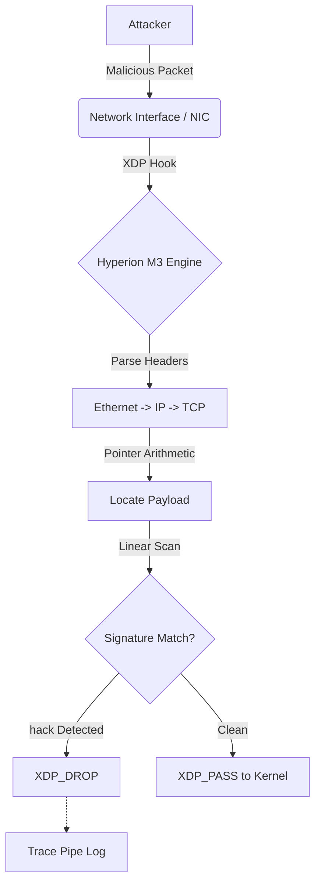

# Project Hyperion: Datapath Security Research


-blue?style=flat-square)


**Hyperion** is a high-performance network security engine designed to enforce content-aware policy at the NIC driver level. Unlike traditional firewalls that operate at the socket layer (Netfilter), Hyperion uses **eBPF (Extended Berkeley Packet Filter)** and **XDP (Express Data Path)** to reject malicious payloads before the Linux Kernel allocates memory.

> **Research Context:** This project serves as the Network Satellite to the [Sentinel Runtime](https://github.com/nevinshine/sentinel-runtime) (Host Anchor). Authored by **Nevin**, it explores the unification of process-level and packet-level defense for the MSc Cybersecurity Research Portfolio.

---

## Research Motivation

Modern endpoint security focuses heavily on process-level control (syscalls). However, by the time a packet reaches a process, the kernel has already consumed significant resources parsing headers and managing buffers.

**The Research Question**
> *Can we inspect packet payloads for malicious signatures at wire speed (O(N)), dropping threats before the OS commits resources?*

### The "Two Towers" Architecture

Hyperion complements Sentinel by securing the transport boundary.

| Dimension | Sentinel (The Host) | Hyperion (The Wire) |
| :--- | :--- | :--- |
| **Boundary** | Process Execution | Network Transport |
| **Mechanism** | `ptrace` / Kernel Modules | `eBPF` / `XDP` |
| **Visibility** | Syscalls (`execve`, `open`) | Payloads (`GET /hack HTTP/1.1`) |
| **Constraint** | Context-Aware Logic | Sub-microsecond Latency |
| **Threats** | Ransomware, Droppers | C2 Commands, Shellcode Injection |

---

## System Architecture

Hyperion operates on a split-plane design, utilizing the driver's interrupt context for maximum throughput.



### 1. Kernel Enforcer (`src/kern/`)

* **Technology:** Restricted C (eBPF).
* **Role:** Parses Layer 7 payloads directly in the driver.
* **M3 Capability:** **Deep Packet Inspection (DPI)**. Implements a bounded loop (`#pragma unroll`) to scan TCP payload bytes for the signature `hack`.
* **Performance:** Zero-Copy drop. The packet is discarded without ever creating an `skb` structure.

### 2. User Space Controller (`src/user/`)

* **Technology:** Go (Cilium eBPF Library).
* **Role:** Loads the XDP program, manages lifecycle, and provides a colored CLI for status monitoring.

---

## Research Roadmap

We define success through distinct capability milestones.

### [Phase M0] Foundation (Complete)

* **Goal:** Establish eBPF toolchain and verification pipeline.
* **Deliverable:** `XDP_PASS` skeleton compiling with Clang/LLVM.

### [Phase M1] Stateless Filtering (Complete)

* **Goal:** Implement high-performance dropping based on L3/L4 headers.
* **Research Validation:** Validated `XDP_DROP` against hardcoded IP targets.

### [Phase M2] Stateful Tracking (Complete)

* **Goal:** Implement stateful logic (Rate Limiting) in BPF Maps.
* **Outcome:** System successfully detected volumetric floods using `BPF_MAP_TYPE_LRU_HASH`.

### [Phase M3] Deep Packet Inspection (Current Status)

* **Goal:** Implement Layer 7 Payload Analysis in XDP.
* **Validation:** Custom logic scans TCP payloads for signature `hack`.
* **Outcome:** Malicious packets are dropped instantly; standard HTTP traffic passes.
* **Metric:** Successfully blocked `netcat` attacks while allowing standard traffic.

### [Phase M4] Dynamic Policy (Next)

* **Goal:** Allow User Space to update signatures dynamically via Maps.

---

## Build & Run

### Prerequisites

* Linux Kernel 5.4+ (BTF Support)
* `clang`, `llvm`, `make`, `golang`

### Quick Start (M3.0)

Hyperion M3 uses a Go-based controller for reliable loading.

```bash
# 1. Compile the Engine
make

# 2. Attach to Interface (e.g., lo or wlp1s0)
sudo ./bin/hyperion_ctrl -iface lo

```

### Verification (The "Live Fire" Test)

**Terminal 1 (Monitor):**

```bash
sudo cat /sys/kernel/debug/tracing/trace_pipe

```

**Terminal 2 (Attack):**

```bash
# This packet will be DROPPED by Hyperion
echo "hack" | nc -w 1 127.0.0.1 8080

```

---

## License

This project is dual-licensed under the **GPLv2** (Kernel components) and **MIT** (User space components) to ensure compatibility with Linux kernel helper access and distribution norms.

---

**Author:** Nevin | **Lab:** Systems Security Research