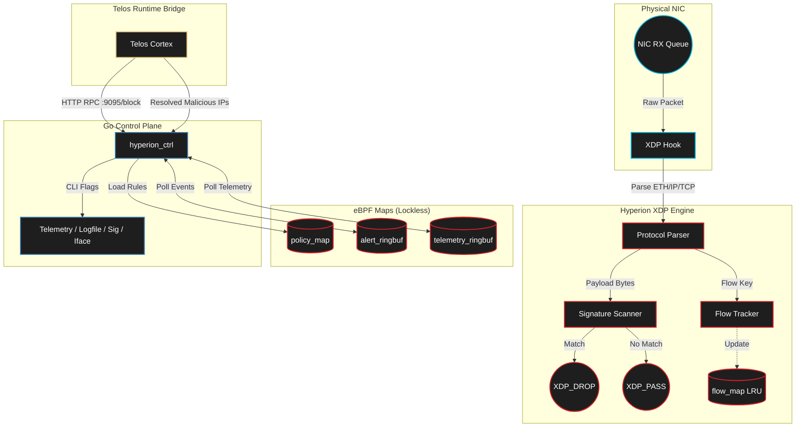

# Hyperion XDP

### Wire-Speed Network Defense at the NIC Boundary

<p align="center">
  
  
  
  
  
</p>

Hyperion XDP is the high-performance network defense satellite for the Sentinel Stack. It provides stateful, wire-speed packet filtering and deep payload inspection utilizing eBPF and XDP (eXpress Data Path) technologies, operating directly within the NIC driver before the Linux kernel even allocates a socket buffer (`sk_buff`).

---

## What is Hyperion XDP? (The Simple Version)

Imagine the Linux network stack is a massive mail sorting facility. Traditional firewalls (like iptables) sit deep inside the facility. By the time they inspect a package, it has already been received, unpacked, and carried halfway through the building.

**Hyperion XDP sits at the loading dock.** Before a packet even enters the building (before the kernel allocates an `sk_buff`), Hyperion intercepts it directly at the Network Interface Card driver.

- When Telos detects a typosquatted domain (e.g., `githuh.com`), it resolves the underlying IP and pushes it to Hyperion via HTTP RPC
- Hyperion inserts the IP into an eBPF `blacklist_map`
- The XDP hook drops matching packets at **wire-speed** using `XDP_DROP`
- The packet is killed before the operating system is even aware of its existence

> [!IMPORTANT]
> Hyperion XDP strictly separates concerns from Telos Runtime. Telos handles the complex semantic AI analysis (typosquatting detection, homoglyph normalization, domain reputation scoring). Hyperion purely handles deterministic, high-speed enforcement. The LLM is **never** in the network hot path.

---

## How It Works (Technical Deep Dive)

Hyperion XDP is powered by **eBPF** (Extended Berkeley Packet Filter) programs attached to the XDP hook point. The XDP hook executes at the lowest possible point in the software stack — directly within the NIC driver's receive path, before `sk_buff` allocation, before the network stack, before iptables.

### Architecture


```mermaid
graph TD
    classDef nicSpace fill:#1e1e1e,stroke:#00ADD8,stroke-width:2px,color:#fff
    classDef kernelSpace fill:#1e1e1e,stroke:#D22128,stroke-width:2px,color:#fff
    classDef userSpace fill:#1e1e1e,stroke:#3776AB,stroke-width:2px,color:#fff
    classDef telosSpace fill:#1e1e1e,stroke:#E5C07B,stroke-width:2px,color:#fff

    subgraph Physical ["Physical NIC"]
        NIC(("NIC RX Queue")) -->|Raw Packet| XDP["XDP Hook"]
    end

    subgraph XDP_Engine ["Hyperion XDP Engine"]
        XDP -->|Parse ETH/IP/TCP| PARSE["Protocol Parser"]
        PARSE -->|Flow Key| FLOW["Flow Tracker"]
        PARSE -->|Payload Bytes| SIG["Signature Scanner"]
        SIG -->|Match| DROP1(("XDP_DROP"))
        SIG -->|No Match| ACCEPT(("XDP_PASS"))
        FLOW -.->|Update| FLOWMAP[("flow_map LRU")]
    end

    subgraph Kernel_Maps ["eBPF Maps (Lockless)"]
        PMAP[("policy_map")]
        ALERT[("alert_ringbuf")]
        TELEM[("telemetry_ringbuf")]
        FLOWMAP
    end

    subgraph User_Space ["Go Control Plane"]
        CTRL["hyperion_ctrl"] -->|Load Rules| PMAP
        CTRL <-->|Poll Events| ALERT
        CTRL <-->|Poll Telemetry| TELEM
        CTRL -->|CLI Flags| FLAGS["Telemetry / Logfile / Sig / Iface"]
    end

    subgraph Telos_Bridge ["Telos Runtime Bridge"]
        TELOS["Telos Cortex"] -->|HTTP RPC :9095/block| CTRL
        TELOS -->|Resolved Malicious IPs| CTRL
    end

    class NIC,XDP nicSpace
    class PARSE,SIG,FLOW,DROP1,ACCEPT kernelSpace
    class PMAP,ALERT,TELEM,FLOWMAP kernelSpace
    class CTRL,FLAGS userSpace
    class TELOS telosSpace
```

### The Dual-Layer Defense

Hyperion implements two independent enforcement mechanisms in the XDP kernel program:

**1. Signature Matching Engine**
- Inspects TCP payload bytes against a configurable policy map
- Rules are loaded via CLI flags (`-sig "malware,hack"`) or from `signatures.txt`
- Up to `MAX_RULES` (2) signature rules checked per packet via `#pragma unroll`
- Matching triggers immediate `XDP_DROP` with full telemetry emission

**2. IP Blacklist Enforcement (Telos Bridge)**
- Telos Domain Intelligence resolves malicious domains to IP addresses
- IPs are pushed to Hyperion via HTTP RPC call to `:9095/block`
- Hyperion inserts IPs into an eBPF blacklist map
- All packets from blacklisted IPs receive `XDP_DROP` at the NIC driver level

> [!NOTE]
> Both enforcement paths operate at **O(1)** using eBPF hash maps. There is zero regex matching, zero string parsing, and zero copying in the hot path. Packet decisions are single hash table probes.

### M5 Telemetry Pipeline

Every packet processed by Hyperion emits a structured telemetry event via the `telemetry_ringbuf`:

| Event Type | Code | Trigger |
|:-----------|:-----|:--------|
| `ACCEPT` | 0 | Packet passed all checks and entered the network stack |
| `DROP` | 1 | Packet dropped due to signature match or IP blacklist |
| `SIG_MATCH` | 2 | Payload bytes matched a loaded signature rule |

Events are consumed by the Go control plane (`hyperion_ctrl`) and optionally written to a logfile for persistent forensic analysis.

> [!CAUTION]
> When attached to a physical NIC, Hyperion XDP drops are **irreversible** at the hardware level. Blacklisted IPs will experience 100% packet loss. Use with caution on production interfaces.

---

## Map Architecture and eBPF Concurrency Mechanics

Stateful tracking within an eBPF context is constrained by the verifier — dynamic memory allocation is strictly prohibited, and loops must be bounded. All state is maintained via predefined BPF maps.

Hyperion XDP utilizes specific map topologies to guarantee lockless concurrency across multiple CPU cores:

| Map Identifier | BPF Map Type | Key Structure | Value Structure | Primary Function |
|:---------------|:-------------|:-------------|:---------------|:-----------------|
| `policy_map` | `BPF_MAP_TYPE_ARRAY` | `__u32` (Rule Index) | `struct policy_t` (8-byte sig + len + active) | Stores signature rules for deep payload inspection |
| `alert_ringbuf` | `BPF_MAP_TYPE_RINGBUF` | N/A | `struct event_t` (src/dst IP + ports + action + payload) | Legacy alert channel for signature match notifications |
| `telemetry_ringbuf` | `BPF_MAP_TYPE_RINGBUF` | N/A | `struct hyp_event` (40 bytes, 8-byte aligned) | M5 structured telemetry for all packet decisions |
| `flow_map` | `BPF_MAP_TYPE_LRU_HASH` | `struct flow_key` (src/dst IP + ports + proto) | `struct flow_value` (packets + bytes + timestamps) | Stateful per-flow tracking with automatic LRU eviction |

> [!NOTE]
> `BPF_MAP_TYPE_LRU_HASH` is utilized for flow tracking specifically to handle high-throughput scenarios. Under heavy network load, the LRU eviction policy ensures that stale flow entries are automatically replaced without failing map insertions. The `telemetry_ringbuf` uses 64KB (`1 << 16`) of contiguous memory, outperforming legacy perf buffers via zero-copy memory mapping.

### Struct Alignment (C / Go Parity)

The `hyp_event` telemetry struct is precisely 40 bytes with explicit padding to guarantee binary compatibility between the C kernel program and the Go user-space controller:

```c
struct hyp_event {
    __u8 event_type;    // 0=ACCEPT, 1=DROP, 2=SIG_MATCH
    __u8 _pad1[3];      // Padding for 4-byte alignment
    __u32 src_ip;
    __u32 dst_ip;
    __u16 src_port;
    __u16 dst_port;
    __u8 protocol;
    __u8 _pad2[7];      // Padding for 8-byte alignment before timestamp
    __u64 timestamp;
    char signature[8];  // Matched signature (if any)
};
```

Both C and Go structs must output exactly `40` bytes. The unit test `TestHypEventStructSize` verifies this invariant.

---

## Features

| Feature | Description |
|:--------|:-----------|
| Wire-Speed XDP Filtering | Packets dropped at NIC driver level before sk_buff allocation |
| Deep Payload Inspection | TCP payload signature matching with unrolled rule loops |
| Structured Telemetry | 40-byte aligned events via BPF_MAP_TYPE_RINGBUF |
| Stateful Flow Tracking | Per-flow packet/byte counters with LRU eviction |
| Telos RPC Bridge | HTTP endpoint receives malicious IPs from Domain Intelligence |
| File Logging | Optional persistent event log for forensic analysis |
| Signal Handling | SIGHUP reloads signatures, SIGTERM graceful shutdown |
| CLI Signatures | Load rules from command line or signatures.txt file |
| Unit Tests | 8 Go tests + struct alignment verification + benchmarks |

---

## Getting Started

### Prerequisites

- Linux Kernel >= 5.4 (XDP + BPF support required)
- Go >= 1.24
- Clang / LLVM (for eBPF compilation)
- `libbpf-dev` (BPF helper headers)
- `bpftool` (for BTF/vmlinux generation)

### Building

```bash
git clone https://github.com/nevinshine/hyperion-xdp.git
cd hyperion-xdp

# Build BPF objects + Go controller
make build

# Verify binary
ls -lh bin/hyperion_ctrl
```

### Running

```bash
# Start on loopback (testing)
sudo ./bin/hyperion_ctrl -iface lo

# Start with telemetry enabled
sudo ./bin/hyperion_ctrl -iface lo -telemetry

# Start with telemetry + file logging
sudo ./bin/hyperion_ctrl -iface lo -telemetry -logfile /tmp/hyperion.log

# Start with custom signatures
sudo ./bin/hyperion_ctrl -iface lo -sig "malware,hack"
```

### CLI Flags

| Flag | Description | Default |
|:-----|:-----------|:--------|
| `-iface` | Network interface to attach XDP program | `wlp1s0` |
| `-telemetry` | Enable structured telemetry event output | `false` |
| `-logfile <path>` | Write events to persistent log file | `""` |
| `-sig <list>` | Comma-separated payload signatures to match | `""` |

---

## Demonstrations

### Demo 1: Telos Bridge Integration

```bash
# Terminal 1: Start Hyperion XDP
sudo ./bin/hyperion_ctrl -iface lo -telemetry

# Terminal 2: Start Telos Runtime
cd ~/sentinel-stack/telos-runtime && sudo -E telos start

# Terminal 3: Query a typosquatted domain
python3 -c "
from dnslib import DNSRecord
q = DNSRecord.question('githuh.com')
r = q.send('127.0.0.1', 5353, tcp=False, timeout=5)
print(DNSRecord.parse(r))
"
```

**Watch Terminal 1:** Hyperion prints `[TELOS-RPC] Added 97.107.140.81 to XDP Blacklist`

### Demo 2: Telemetry Pipeline

```bash
# Terminal 1: Start with telemetry and logging
sudo ./bin/hyperion_ctrl -iface lo -telemetry -logfile /tmp/hyperion.log

# Terminal 2: Generate traffic
ping -c 100 localhost
curl http://localhost:8080/

# Terminal 3: Monitor events in real-time
tail -f /tmp/hyperion.log
```

### Demo 3: Interactive Telemetry Demo

```bash
sudo ./demo_telemetry.sh
```

---

## Performance

Benchmarked with Go unit tests:

| Benchmark | Result | Description |
|:----------|:-------|:-----------|
| Event Formatting | ~1025 ns/op | Format a telemetry event to string |
| Binary Encode/Decode | Verified | 40-byte struct round-trip serialization |
| Struct Alignment | C=40, Go=40 | Binary compatibility confirmed |

> [!NOTE]
> Wire-speed performance. The XDP program executes in the NIC driver's receive path before any kernel allocation. Throughput is bounded exclusively by hardware limits, not software inference delays.

---

## Project Structure

```
hyperion-xdp/
├── src/
│   ├── kern/
│   │   ├── hyperion_core.c    # XDP eBPF program (filter + telemetry)
│   │   └── vmlinux.h          # Generated kernel type header (CO-RE)
│   └── user/
│       ├── main.go            # Go control plane (CLI + RPC + ringbuf)
│       ├── main_test.go       # 8 unit tests + benchmarks
│       ├── bpf_bpfel.go       # Generated eBPF loader (little-endian)
│       ├── bpf_bpfel.o        # Compiled BPF ELF object
│       ├── bpf_bpfeb.go       # Generated eBPF loader (big-endian)
│       └── bpf_bpfeb.o        # Compiled BPF ELF object
├── docs/
│   ├── TELEMETRY.md           # Telemetry event format specification
│   ├── TESTING.md             # Manual testing guide
│   └── TEST_REPORT.md         # Full test execution report
├── benchmarks/                # Performance test scripts
├── assets/                    # Documentation assets
├── signatures.txt             # Default signature rules
├── demo_telemetry.sh          # Interactive telemetry demo
├── test_all_local.sh          # Comprehensive 8-section test suite
├── test_integration.sh        # 10-point integration test
├── test_hyperion.sh           # Quick smoke test
├── LOCAL_TESTING.md           # Step-by-step local testing guide
├── Makefile                   # Build system
└── README.md
```

---

## Engineering Milestones

<details>
<summary><b>M1-M2: Foundation</b> — Basic XDP filter and blacklist map</summary>

- XDP program attached to NIC interface via `cilium/ebpf` Go library
- Basic packet parsing: Ethernet -> IP -> TCP header extraction
- Verifier-safe bounds checking with explicit pointer validation
- `policy_map` for configurable signature rules

</details>

<details>
<summary><b>M3: Deep Payload Inspection</b> — Signature matching engine</summary>

- TCP payload scanning against loaded signature rules
- `#pragma unroll` for verifier-safe bounded iteration
- `alert_ringbuf` for real-time match notifications to user-space
- `XDP_DROP` action on signature match

</details>

<details>
<summary><b>M4: Telos Integration</b> — Domain Intelligence bridge</summary>

- HTTP RPC endpoint on `:9095/block` receives malicious IPs from Telos
- IP insertion into eBPF blacklist map
- Wire-speed enforcement — packets killed before reaching the network stack
- Bidirectional integration with Telos Domain Intelligence L0-L4 pipeline

</details>

<details>
<summary><b>M5: Structured Telemetry</b> — Production observability</summary>

- 40-byte `hyp_event` struct with explicit padding for C/Go binary parity
- `telemetry_ringbuf` (64KB BPF_MAP_TYPE_RINGBUF) for all packet decisions
- `flow_map` (BPF_MAP_TYPE_LRU_HASH) for stateful per-flow tracking
- Go consumer with CLI flags: `-telemetry`, `-logfile`, `-sig`
- SIGHUP signal handler for live signature reload
- 8 unit tests + benchmarks + struct alignment verification

</details>

---

## Testing

```bash
# Run comprehensive 8-section test suite
sudo ./test_all_local.sh

# Run Go unit tests only
cd src/user && go test -v

# Run 10-point integration tests
./test_integration.sh

# Run benchmarks
cd src/user && go test -bench=. -benchmem

# Quick smoke test
./test_hyperion.sh
```

| Test Suite | Command | Expected |
|:-----------|:--------|:---------|
| Full Automated | `sudo ./test_all_local.sh` | 8 sections pass |
| Unit Tests | `cd src/user && go test -v` | 8/8 pass |
| Integration | `./test_integration.sh` | 10/10 pass |
| Benchmarks | `cd src/user && go test -bench=.` | ~1025 ns/op |

---

## Performance Considerations (Latency Anti-Hype)

> [!TIP]
> The Sentinel Stack explicitly rejects the integration of Large Language Models (LLMs) directly within the network hot path. Executing semantic evaluation during an interrupt context introduces massive, unacceptable latency and fundamentally compromises the host operating system's networking stack. By restricting `hyperion-xdp` to purely deterministic, IP-based operations at the physical NIC level and offloading semantic intelligence to the `telos-runtime` daemon, the architecture maintains microsecond latency. Throughput remains bounded exclusively by hardware limits, not by software inference delays.

---

## Architecture and Interoperability Matrix

| Execution Layer | Sentinel Component | Primary Technology & Enforcement | Strategic Objective |
|:------|:------|:------|:------|
| Ring -1 (Hypervisor) | `sentinel-vmi` | AMD-V / NPT Guard / ARMv8 EL2 | Out-of-band Hypervisor Introspection, memory monitoring |
| Ring 0 (Compile) | `sentinel-cc` | LLVM / Policy-Carrying Code | Compile-time intent validation, Deep CFI, ASLR-aware enforcement |
| Ring 0 (Runtime) | `telos-runtime` | eBPF-LSM | Intent correlation, Information Flow Control (IFC), and Taint Tracking |
| Ring 0 (Runtime) | Sentinel RT | Seccomp / eBPF / io_uring | Host Intrusion Detection System (HIDS), Citadel recursive tracking |
| **Wire / Physical NIC** | **`hyperion-xdp`** | XDP / eBPF | Wire-speed network drop and proxy enforcement |

---

## Development

```bash
make build          # Build BPF objects + Go controller
make clean          # Clean all artifacts
make run            # Build and attach to loopback
```

---

## License

GPL License — see [LICENSE](LICENSE).

---

<p align="center">
  <b>Hyperion XDP</b> — <em>Because threats die at the wire.</em>
</p>
