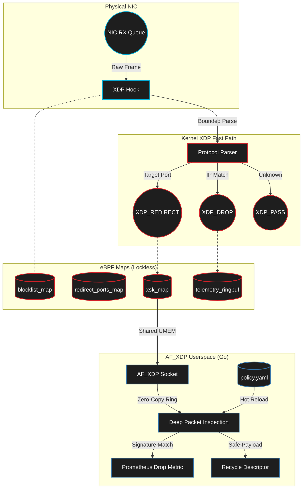

# Hyperion XDP

### High-Performance AF_XDP Enforcement & Telemetry Dataplane

<p align="center">
  
  
  
  
  
</p>

Hyperion XDP is a measurable, infrastructure-grade network dataplane designed for extreme high-throughput packet filtering and Deep Packet Inspection (DPI). By leveraging eBPF and AF_XDP zero-copy sockets, Hyperion intercepts traffic directly at the NIC driver—before the Linux kernel network stack allocates an `sk_buff`—yielding low-latency, high-throughput packet processing with explicit queue-level observability.

---

## Architectural Split: Fast Path vs. Slow Path

To maintain strict eBPF verifier discipline and guarantee hardware-bound throughput, Hyperion physically segregates packet processing.


```mermaid
graph TD
    classDef nicSpace fill:#1e1e1e,stroke:#00ADD8,stroke-width:2px,color:#fff
    classDef kernelSpace fill:#1e1e1e,stroke:#D22128,stroke-width:2px,color:#fff
    classDef userSpace fill:#1e1e1e,stroke:#3776AB,stroke-width:2px,color:#fff

    subgraph Physical ["Physical NIC"]
        NIC(("NIC RX Queue")) -->|Raw Frame| XDP["XDP Hook"]
    end

    subgraph Fast_Path ["Kernel XDP Fast Path"]
        XDP -->|Bounded Parse| PARSE["Protocol Parser"]
        PARSE -->|IP Match| DROP1(("XDP_DROP"))
        PARSE -->|Target Port| REDIRECT(("XDP_REDIRECT"))
        PARSE -->|Unknown| ACCEPT(("XDP_PASS"))
    end

    subgraph Kernel_Maps ["eBPF Maps (Lockless)"]
        BL[("blocklist_map")]
        RM[("redirect_ports_map")]
        XM[("xsk_map")]
        TE[("telemetry_ringbuf")]
    end

    subgraph Slow_Path ["AF_XDP Userspace (Go)"]
        AFXDP["AF_XDP Socket"] -->|Zero-Copy Ring| DPI["Deep Packet Inspection"]
        DPI -->|Signature Match| METRIC_DROP["Prometheus Drop Metric"]
        DPI -->|Safe Payload| RECYCLE["Recycle Descriptor"]
        YAML[("policy.yaml")] -->|Hot Reload| DPI
    end

    XDP -.- BL
    REDIRECT -.-> XM
    XM ===>|Shared UMEM| AFXDP
    DROP1 -.-> TE

    class NIC,XDP nicSpace
    class PARSE,DROP1,ACCEPT,REDIRECT kernelSpace
    class BL,RM,XM,TE kernelSpace
    class AFXDP,DPI,METRIC_DROP,YAML,RECYCLE userSpace
```

### FAST PATH (Kernel/XDP)
The XDP hook guarantees bounded, stateless processing.
- **`O(1)` IP Blocklists**: Instant `XDP_DROP` for known malicious actors via LRU Hash map.
- **Malformed Packet Rejection**: Hardware-level bounds checking on headers.
- **AF_XDP Redirection**: Target protocols (e.g., UDP 53) are pushed into the `xsk_map` bypassing the Linux stack completely.

### SLOW PATH (AF_XDP Userspace)
Heavy lifting is punted to the Go userspace engine via `github.com/asavie/xdp`.
- **Deep Packet Inspection (DPI)**: Regex and signature analysis on full packet payloads.
- **Telemetry Correlation**: Prometheus endpoint tracking inspection latency, drop rates, and queue saturation.
- **Structured Policy Engine**: Evaluates `policy.yaml` with support for `SIGHUP` hot-reloads.

---

## Zero-Copy Queue Lifecycle Orchestration

Hyperion has evolved from a simple packet engine into a **hardware queue orchestration runtime**. Rigorous behavioral isolation experiments on Mellanox `mlx5` zero-copy architectures have demonstrated that logical AF_XDP queue teardown (closing the socket) is insufficient to terminate hardware descriptor ownership.

The experiments indicate that safe queue orchestration requires coordination across multiple independent state planes:

1. **Traffic Steering Plane** (`ethtool -X` / RSS)
   * Determines which hardware RX queues physically receive packets from the wire.
2. **eBPF Redirect Plane** (`xsk_map`)
   * Controls whether packets are redirected into AF_XDP userspace sockets.
3. **DMA Descriptor Ownership Plane**
   * Governs UMEM descriptor refill ownership and AF_XDP queue memory registration.
4. **Firmware Execution Plane**
   * Internal NIC firmware execution state responsible for descriptor polling, retry behavior, queue execution context, and DMA scheduling.

### Experimental Findings

Controlled fault-injection experiments demonstrated several critical behaviors on the tested `mlx5` stack:

* Destroying AF_XDP UMEM ownership under load can trigger persistent descriptor retry loops (`rx*_xsk_buff_alloc_err`) inside the NIC firmware.
* Removing queues from RSS steering and deleting `xsk_map` redirects does not necessarily terminate firmware-level polling behavior.
* Dynamic rebinding of a fresh UMEM to a queue trapped in a retry state triggered severe node instability and DMA-related failures on the tested hardware.
* Physical interface reset (`ip link down/up`) successfully terminated the retry state and restored convergence.

A key finding of the experiments is that Linux-visible queue teardown semantics can successfully complete while firmware-visible descriptor execution remains permanently active, creating a divergence between software teardown state and hardware execution state.

> [!IMPORTANT]
> The reported behaviors were observed specifically on Mellanox ConnectX-4 Lx hardware using the `mlx5_core` driver and Linux 6.8 with AF_XDP zero-copy sockets. The experiments do not claim universal behavior across all NIC vendors, driver implementations, or AF_XDP architectures.

These observations indicate that software-visible teardown completion does not necessarily imply hardware-level execution convergence.

### Architectural Implications

The experiments imply that safe live queue-local rehabilitation may not currently be achievable on the tested `mlx5_core` / ConnectX-4 Lx / Linux 6.8 stack once persistent descriptor retry states emerge.

As a result, Hyperion treats queue lifecycle orchestration as a first-class systems concern, emphasizing:

* deterministic queue fencing
* explicit RSS control
* watchdog-driven degradation semantics
* descriptor convergence monitoring
* orchestration-aware teardown sequencing
* interface-wide recovery policies when queue-local recovery is unsafe

---

## Research Contributions

Hyperion contributes several experimentally-derived observations regarding AF_XDP zero-copy lifecycle behavior under sustained load:

* empirical characterization of persistent descriptor retry states
* queue-level teardown and rebinding failure analysis
* isolation of firmware-visible versus Linux-visible teardown divergence
* deterministic queue fencing and RSS orchestration methodology
* descriptor convergence telemetry instrumentation
* watchdog-driven degradation semantics for AF_XDP dataplanes
* orchestration-aware queue lifecycle modeling under adversarial failure conditions

The project therefore serves both as an experimental high-performance XDP dataplane and as a systems research platform for studying zero-copy queue orchestration behavior.

---

## Known Limitations

Current observations are constrained to:

- Mellanox ConnectX-4 Lx hardware
- `mlx5_core`
- Linux 6.8
- AF_XDP zero-copy mode
- `asavie/xdp` userspace bindings

The project has not yet validated:
- Intel `ice`
- Intel `ixgbe`
- Broadcom NICs
- multi-NUMA queue migration
- SmartNIC offload architectures
- shared-UMEM queue orchestration
- hardware-assisted queue reset semantics

---

## Performance Engineering (Benchmarking)

Hyperion proves its claims via isolated namespace benchmarking using `veth` pairs and `iperf3` / `tcpreplay`.

```bash
# 1. Start the isolated network namespace sandbox
sudo ./scripts/netns_sandbox.sh

# 2. Attach Hyperion to the sandbox interface
sudo ./bin/hyperion_ctrl -iface veth0

# 3. Blast 10Gbps UDP traffic and measure CPU/PPS
sudo ./benchmarks/benchmark_suite.sh
```

### Advanced Observability
Hyperion exposes a `/metrics` Prometheus endpoint on port `2112`, tracking:
- `hyperion_fastpath_drops_total`: Packets killed in the kernel.
- `hyperion_slowpath_drops_total`: Packets dropped by AF_XDP DPI.
- `hyperion_redirect_failures_total`: Map redirect failures (userspace disconnects).
- `hyperion_afxdp_rx_queue_pressure`: Ring buffer occupancy.

---

## Queue Lifecycle & Failure-Semantics Benchmarking

Hyperion's benchmarking framework extends beyond throughput measurement into deterministic queue lifecycle analysis and failure-semantics validation.

The benchmarking harness captures:

* queue occupancy oscillation
* watchdog transition timing
* degradation-state dwell distributions
* IRQ topology stability
* scheduler jitter
* NAPI budget pressure
* descriptor retry convergence behavior
* AF_XDP teardown semantics under sustained load

### Experimental Infrastructure

Experiments are executed on isolated CloudLab bare-metal systems using Mellanox `mlx5` NICs with explicit IRQ affinity pinning, CPU governor locking, RSS control, and continuous telemetry capture.

Telemetry streams include:

* `/proc/interrupts`
* `/proc/net/softnet_stat`
* `ethtool -S`
* `bpftool`
* `turbostat`
* Prometheus queue metrics
* AF_XDP descriptor pressure metrics

### Failure Injection Methodology

Hyperion includes controlled fault injection for studying dataplane degradation and recovery behavior under stress conditions:

* AF_XDP userspace termination (`SIGTERM`, `SIGKILL`)
* queue fencing (`xsk_map` detach)
* RSS steering withdrawal
* descriptor starvation
* queue-local teardown
* live rebinding experiments
* saturation-induced degradation

The objective is not merely to maximize packets-per-second, but to characterize how zero-copy dataplanes behave during ownership transitions, teardown races, and hardware retry conditions.

---

## Failure-Mode Documentation

Infrastructure credibility requires deterministic behavior when things break. Hyperion implements explicit failure states:

| Failure Scenario | Resolution | Security Stance |
|:-----------------|:-----------|:----------------|
| **Go Userspace Crash** | `bpf_redirect_map` returns an error if the AF_XDP socket (`xsk_map`) is dead or not bound. | **Fail-Closed (Optional)** or **Fail-Open (Default)**. Currently, unroutable AF_XDP packets fall back to `XDP_PASS` to avoid network isolation, incrementing the `hyperion_redirect_failures_total` Prometheus counter. |
| **Rx Queue Overflow** | If the AF_XDP fill ring is exhausted, the kernel drops the packet. | **Fail-Closed**. Packets are dropped, incrementing interface `rx_dropped` counters. |
| **Map Exhaustion** | The IP blocklist utilizes `BPF_MAP_TYPE_LRU_HASH`. | **Self-Healing**. Stale IP addresses are automatically evicted to make room for new blocks. |

---

## Verifier Statistics & Discipline

Writing raw eBPF requires strict adherence to verifier budgets to ensure the kernel doesn't deadlock. Hyperion's `hyperion_core.c` operates well below these limits:

- **Instruction Count**: ~150 instructions (Limit: 1,000,000). By removing payload signature loops (`#pragma unroll`) from the kernel and punting them to AF_XDP, we achieved a massive reduction in logic depth.
- **Stack Usage**: ~128 bytes (Limit: 512 bytes). Variables are tightly scoped, and large structs are pushed directly into ring buffers.
- **Tail-Call Depth**: 0 (Limit: 33). The dataplane is currently monolithic but modular enough to support tail-call pipelines in the future if required.
- **Helper Calls**: Strictly limited to `bpf_map_lookup_elem`, `bpf_redirect_map`, and `bpf_ringbuf_*`.

---

## Getting Started

### Prerequisites
- Linux Kernel >= 5.4 (XDP + AF_XDP support required)
- Go >= 1.24
- Clang / LLVM (for eBPF compilation)

### Building
```bash
make build
```

### Policy Configuration (`policy.yaml`)
```yaml
fast_path:
  drop_ips: ["198.51.100.42"]
  redirect_ports:
    - protocol: 17
      port: 53

slow_path:
  dns_rules:
    - match: "evil.com"
      action: "drop"
```

## License
GPL License — see [LICENSE](LICENSE).
