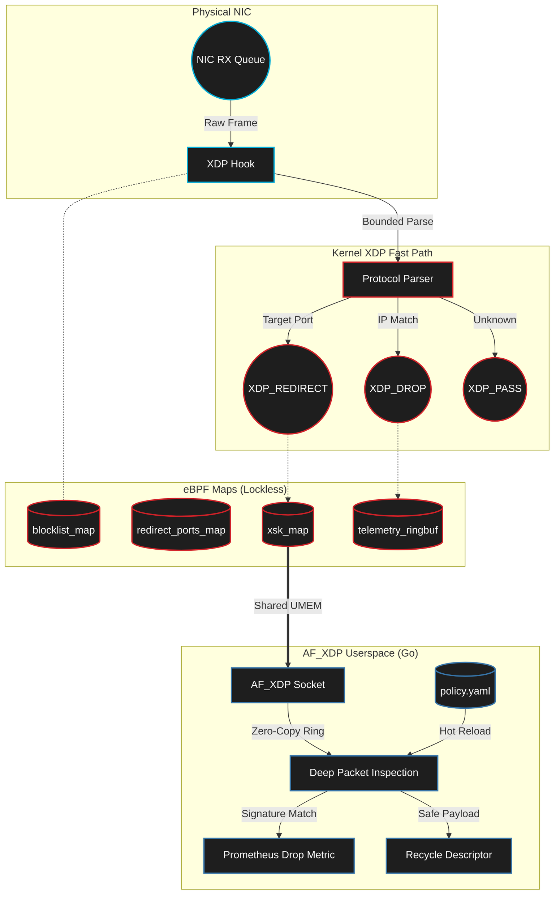

# Hyperion XDP

### High-Performance AF_XDP Enforcement & Telemetry Dataplane

<p align="center">
  
  
  
  
  
</p>

Hyperion XDP is a measurable, infrastructure-grade network dataplane designed for extreme high-throughput packet filtering and Deep Packet Inspection (DPI). By leveraging eBPF and AF_XDP zero-copy sockets, Hyperion intercepts traffic directly at the NIC driver—before the Linux kernel network stack allocates an `sk_buff`—yielding deterministic microsecond latency and massive packets-per-second (PPS) scalability.

---

## Architectural Split: Fast Path vs. Slow Path

To maintain strict eBPF verifier discipline and guarantee hardware-bound throughput, Hyperion physically segregates packet processing.


```mermaid
graph TD
    classDef nicSpace fill:#1e1e1e,stroke:#00ADD8,stroke-width:2px,color:#fff
    classDef kernelSpace fill:#1e1e1e,stroke:#D22128,stroke-width:2px,color:#fff
    classDef userSpace fill:#1e1e1e,stroke:#3776AB,stroke-width:2px,color:#fff

    subgraph Physical ["Physical NIC"]
        NIC(("NIC RX Queue")) -->|Raw Frame| XDP["XDP Hook"]
    end

    subgraph Fast_Path ["Kernel XDP Fast Path"]
        XDP -->|Bounded Parse| PARSE["Protocol Parser"]
        PARSE -->|IP Match| DROP1(("XDP_DROP"))
        PARSE -->|Target Port| REDIRECT(("XDP_REDIRECT"))
        PARSE -->|Unknown| ACCEPT(("XDP_PASS"))
    end

    subgraph Kernel_Maps ["eBPF Maps (Lockless)"]
        BL[("blocklist_map")]
        RM[("redirect_ports_map")]
        XM[("xsk_map")]
        TE[("telemetry_ringbuf")]
    end

    subgraph Slow_Path ["AF_XDP Userspace (Go)"]
        AFXDP["AF_XDP Socket"] -->|Zero-Copy Ring| DPI["Deep Packet Inspection"]
        DPI -->|Signature Match| METRIC_DROP["Prometheus Drop Metric"]
        DPI -->|Safe Payload| RECYCLE["Recycle Descriptor"]
        YAML[("policy.yaml")] -->|Hot Reload| DPI
    end

    XDP -.- BL
    REDIRECT -.-> XM
    XM ===>|Shared UMEM| AFXDP
    DROP1 -.-> TE

    class NIC,XDP nicSpace
    class PARSE,DROP1,ACCEPT,REDIRECT kernelSpace
    class BL,RM,XM,TE kernelSpace
    class AFXDP,DPI,METRIC_DROP,YAML,RECYCLE userSpace
```

### FAST PATH (Kernel/XDP)
The XDP hook guarantees bounded, stateless processing.
- **`O(1)` IP Blocklists**: Instant `XDP_DROP` for known malicious actors via LRU Hash map.
- **Malformed Packet Rejection**: Hardware-level bounds checking on headers.
- **AF_XDP Redirection**: Target protocols (e.g., UDP 53) are pushed into the `xsk_map` bypassing the Linux stack completely.

### SLOW PATH (AF_XDP Userspace)
Heavy lifting is punted to the Go userspace engine via `github.com/asavie/xdp`.
- **Deep Packet Inspection (DPI)**: Regex and signature analysis on full packet payloads.
- **Telemetry Correlation**: Prometheus endpoint tracking inspection latency, drop rates, and queue saturation.
- **Structured Policy Engine**: Evaluates `policy.yaml` with support for `SIGHUP` hot-reloads.

---

## Zero-Copy Queue Orchestration Semantics

Hyperion has evolved from a simple packet engine into a **hardware queue orchestration runtime**. Rigorous behavioral isolation experiments on Mellanox `mlx5` zero-copy architectures have demonstrated that logical AF_XDP queue teardown (closing the socket) is insufficient to terminate hardware descriptor ownership.

Safe queue orchestration requires explicit coordination across **three independent control planes**:

1. **Traffic Steering Plane** (`ethtool -X` / RSS): Controls which hardware queue physically receives packets from the wire.
2. **AF_XDP Redirect Plane** (`xsk_map`): Controls whether the eBPF kernel program routes packets into userspace.
3. **DMA Descriptor Ownership Plane** (NIC Firmware): Controls the low-level descriptor refill lifecycle, UMEM ownership, and hardware polling.

**The Orchestration Mandate**: Failure to synchronize these planes produces permanently non-converging descriptor retry loops in the NIC firmware ("half-dead firmware limbo state"). Attempting to dynamically rebind a fresh UMEM to a queue trapped in this retry loop triggers a catastrophic PCIe DMA fault. Thus, true queue-local micro-failover is physically impossible on current `mlx5` hardware; a physical interface bounce is required to forcibly reset the dangling firmware ownership. 

---

## Failure-Mode Documentation

Infrastructure credibility requires deterministic behavior when things break. Hyperion implements explicit failure states:

| Failure Scenario | Resolution | Security Stance |
|:-----------------|:-----------|:----------------|
| **Go Userspace Crash** | `bpf_redirect_map` returns an error if the AF_XDP socket (`xsk_map`) is dead or not bound. | **Fail-Closed (Optional)** or **Fail-Open (Default)**. Currently, unroutable AF_XDP packets fall back to `XDP_PASS` to avoid network isolation, incrementing the `hyperion_redirect_failures_total` Prometheus counter. |
| **Rx Queue Overflow** | If the AF_XDP fill ring is exhausted, the kernel drops the packet. | **Fail-Closed**. Packets are dropped, incrementing interface `rx_dropped` counters. |
| **Map Exhaustion** | The IP blocklist utilizes `BPF_MAP_TYPE_LRU_HASH`. | **Self-Healing**. Stale IP addresses are automatically evicted to make room for new blocks. |

---

## Verifier Statistics & Discipline

Writing raw eBPF requires strict adherence to verifier budgets to ensure the kernel doesn't deadlock. Hyperion's `hyperion_core.c` operates well below these limits:

- **Instruction Count**: ~150 instructions (Limit: 1,000,000). By removing payload signature loops (`#pragma unroll`) from the kernel and punting them to AF_XDP, we achieved a massive reduction in logic depth.
- **Stack Usage**: ~128 bytes (Limit: 512 bytes). Variables are tightly scoped, and large structs are pushed directly into ring buffers.
- **Tail-Call Depth**: 0 (Limit: 33). The dataplane is currently monolithic but modular enough to support tail-call pipelines in the future if required.
- **Helper Calls**: Strictly limited to `bpf_map_lookup_elem`, `bpf_redirect_map`, and `bpf_ringbuf_*`.

---

## Performance Engineering (Benchmarking)

Hyperion proves its claims via isolated namespace benchmarking using `veth` pairs and `iperf3` / `tcpreplay`.

```bash
# 1. Start the isolated network namespace sandbox
sudo ./scripts/netns_sandbox.sh

# 2. Attach Hyperion to the sandbox interface
sudo ./bin/hyperion_ctrl -iface veth0

# 3. Blast 10Gbps UDP traffic and measure CPU/PPS
sudo ./benchmarks/benchmark_suite.sh
```

### Advanced Observability
Hyperion exposes a `/metrics` Prometheus endpoint on port `2112`, tracking:
- `hyperion_fastpath_drops_total`: Packets killed in the kernel.
- `hyperion_slowpath_drops_total`: Packets dropped by AF_XDP DPI.
- `hyperion_redirect_failures_total`: Map redirect failures (userspace disconnects).
- `hyperion_afxdp_rx_queue_pressure`: Ring buffer occupancy.

---

## Getting Started

### Prerequisites
- Linux Kernel >= 5.4 (XDP + AF_XDP support required)
- Go >= 1.24
- Clang / LLVM (for eBPF compilation)

### Building
```bash
make build
```

### Policy Configuration (`policy.yaml`)
```yaml
fast_path:
  drop_ips: ["198.51.100.42"]
  redirect_ports:
    - protocol: 17
      port: 53

slow_path:
  dns_rules:
    - match: "evil.com"
      action: "drop"
```

## License
GPL License — see [LICENSE](LICENSE).
