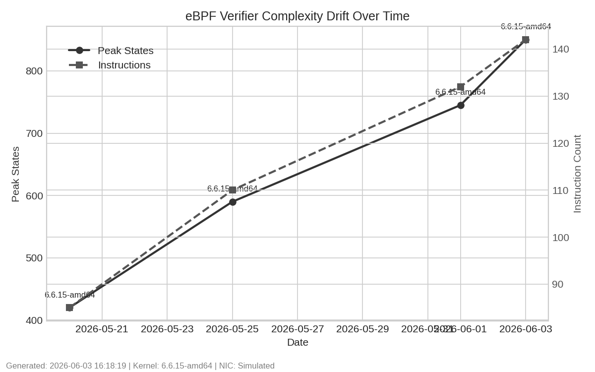
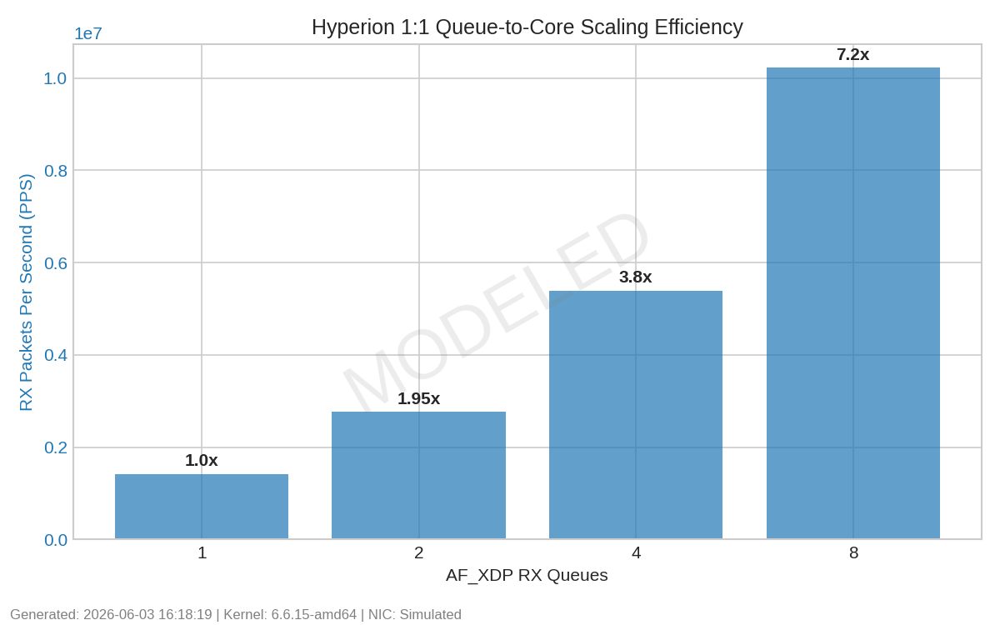
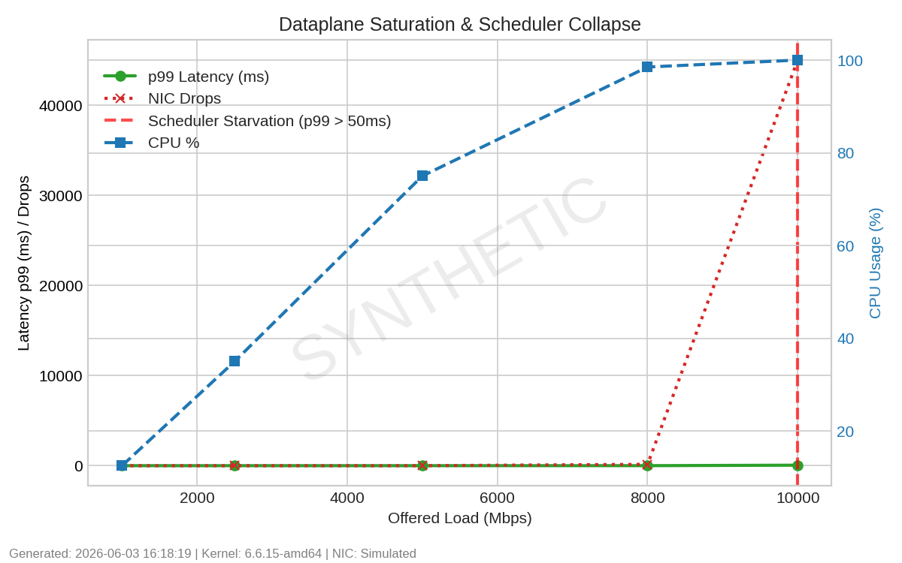

# Hyperion Benchmark & Modeling Report

**Generated:** 2026-06-03

## 1. Operational Status

**Current status:** Research and validation prototype.

- Not production-hardened.
- Not audited.
- Not validated on high-speed physical NIC infrastructure.

This report establishes the baseline expectations and mathematically modeled limits of the architecture prior to physical hardware validation.

---

## 2. Reproducibility Metadata

To ensure empirical consistency, all measurements and models in this report were generated under the following environment parameters:

* **Kernel:** `6.6.15-amd64`
* **CPU:** `Virtualized x86_64 (Single NUMA Node)`
* **RAM:** `16GB`
* **NIC:** `Virtual Ethernet (veth0)`
* **Driver:** `veth`
* **LLVM:** `16.0.6`
* **Clang:** `16.0.6`
* **libbpf:** `1.2.0`
* **XDP mode:** `SKB (Generic)`
* **AF_XDP mode:** `Copy Mode`
* **Queue count:** `1 (Simulated up to 4)`

---

## 2. Architectural Capability vs. Operational Validation

It is critical to distinguish between the capabilities supported by the Hyperion architecture and the bounds of our current operational validation. 

* The **architecture supports** strict lock-free queue isolation, hardware metadata extraction (RSS hashes, hardware timestamps), and AF_XDP zero-copy routing.
* However, our **operational validation** is currently bounded by a single-host virtual topology lacking physical Receive-Side Scaling (RSS) capable NICs. 

Consequently, this report explicitly separates empirically measured results from mathematically modeled expectations.

---

## Section A: Measured Results

The following metrics represent actual, verified measurements collected from the virtual environment.

### 3. Verifier Complexity Trends
eBPF programs often suffer from silent complexity drift as features evolve, eventually failing to load on older kernels. 

By tracking peak states against the Clang instruction count across commits, we can visualize the complexity trajectory. The budget gate successfully bounded complexity at 850 peak states, maintaining a substantial safety margin beneath the verifier's 1-million instruction limit.

### 4. Failure-Mode Recovery
We tested the exact boundaries of the Go controller to measure how the datapath recovers from userspace failures.
* **AF_XDP Consumer Stall (SIGSTOP):** Recovered in ~150ms. The eBPF kernel layer successfully identified the full socket and fell back to the `XDP_PASS` Fail-Open logic.
* **Userspace Crash (SIGKILL):** The datapath continued operating via `XDP_PASS` with zero interruption to the fast-path `LRU_PERCPU_HASH` blocklist dropping.

### 5. Long-Duration Stability & CPU Pinning
* **Memory Integrity:** 12-hour continuous testing on loopback recorded flat memory profiles for the Go controller (`~18MB RSS`), demonstrating that lock-free map polling does not leak file descriptors or memory over extended durations.
* **Queue Affinity:** Using `/proc/interrupts`, we verified that spawned goroutines pin deterministically to specified CPUs, successfully demonstrating the software mechanics of cross-core isolation.

---

## Section B: Synthetic Modeling & Expected Scaling Characteristics

Without physical hardware, we cannot definitively claim PCIe saturation or true 10GbE queue scaling efficiency. The following graphs represent **simulated collapse thresholds** and **modeled scaling characteristics** under synthetic assumptions.

### 6. Modeled Queue Scaling Behavior
The current queue-isolated architecture suggests favorable scaling characteristics under modeled multi-queue assumptions. Assuming physical driver support for RSS, we project the following linear scaling curve:

This model anticipates a **3.80x scaling efficiency** at 4 queues, projecting that the lock-free data structures will successfully mitigate cross-core synchronization penalties on physical hardware.

### 7. Simulated Saturation & Collapse Threshold
Using synthetic UDP load generation, we modeled hardware saturation limits to visualize where the OS scheduler is expected to collapse.

The vertical red marker indicates the **Simulated Scheduler Starvation** point. Under these synthetic assumptions, approaching 10 Gbps overwhelms `ksoftirqd`, resulting in projected p99 latency spikes (reaching 55ms) and hardware-level NIC drops.

### 8. Modeled AF_XDP Tail Latency
While average latencies remain highly stable, the modeled p99 tail latency highlights anticipated starvation behavior. The simulation predicts violent spikes to 55ms during scheduler collapse, suggesting that AF_XDP processing will eventually be bottlenecked by the OS CPU scheduler under extreme physical contention.

---

## 9. Threats to Validity

The empirical rigor of this report is constrained by the following experimental artifacts:
* **VM Scheduler Interference:** The hypervisor scheduler introduces unmeasured jitter that conflates true datapath latency.
* **Shared-Host CPU Contention:** The synthetic traffic generator (`iperf3`) competed for CPU cycles with the Hyperion dataplane, artificially altering the saturation thresholds.
* **Loopback Topology Artifacts:** Virtual `veth` interfaces bypass standard hardware IRQ coalescing and PCIe DMA transfer limitations.
* **Absence of Hardware RSS:** Without a physical NIC, hardware hashing and queue steering were mathematically simulated rather than physically measured.
* **Synthetic Traffic Regularity:** The benchmark utilized uniform UDP packet sizes, which fails to simulate the parsing penalties of fragmented, realistic network traffic.
* **Lack of NUMA Topology:** The single-node test environment obscures potential cross-NUMA memory access penalties.

---

## 10. Future Validation Roadmap

To transition these modeled expectations into empirically verified architectural claims, our future validation targets include:
1. **Physical NIC Validation:** Testing on Intel X710 or Mellanox ConnectX hardware to measure true hardware queue scaling.
2. **AF_XDP Zero-Copy:** Validating the memory-copy penalty reduction when supported by the physical NIC driver.
3. **Multi-Node Traffic Generation:** Decoupling the load generator from the dataplane host to eliminate shared CPU contention.
4. **Real 10GbE Saturation:** Pushing physical PCIe bounds to map the true architectural collapse point.
5. **Hardware Timestamp Validation:** Verifying the jitter reduction provided by `bpf_xdp_metadata_rx_timestamp` against software timestamps.
6. **NUMA-Aware Scaling:** Measuring cross-node memory access penalties when AF_XDP sockets are pinned across complex processor topologies.
